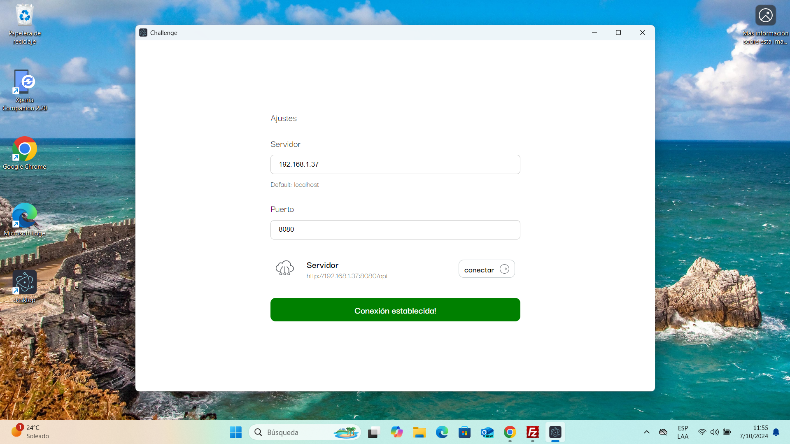

# Tutorial de instalación del Desafio proupesto
Este tutorial intenta explicar de forma simple y directa a quienes esten interesados en como se procede a implementar la solucion al desafio.

## Mantenedor


**Javier Avila**  

- **Correo electrónico:** [njavilas2015@gmail.com](mailto:njavilas2015@gmail.com)
- **GitHub:** [gitlab.com/njavilas2015](https://gitlab.com/njavilas2015)
- **LinkedIn:** [linkedin.com/in/javieravilaredes](https://linkedin.com/in/javieravilaredes)


# Inicio y configuración
Para iniciar el sistema es necesario 
- [x] clonar el repositorio ```git clone https://gitlab.com/njavilas2015/desafio-aitsolutions.com.ar.git```
- [x] iniciar el script entry_point.sh ```bash entry_point.sh```

**Es importante tener en cuenta que se necesita tener docker y docker-compose instalado**

# Panel de Administración
Podremos ingresar al panel de administración ingresando con las credenciales que definimos en el deployment la uri es ```http://<server>:8080/admin/```

```bash
#Default 
DJANGO_SUPERUSER_USERNAME=admin
DJANGO_SUPERUSER_EMAIL=admin@example.com
DJANGO_SUPERUSER_PASSWORD=strongpassword123
```


Podremos crear instancias desde el panel


Asi podremos visualizarlas


Si ingresamos a ```http://<server>:8080/api/article/``` podremos ver e interactuar con django rest  framework


## App Multiplataforma
El mismo código esta adaptado para diferentes dispositivos, en la carpeta ```frontend/apps``` podremos visualizar que disponemos 

[App para Android](https://github.com/njavilas2015/challenge-aitsolutions.com.ar/releases/download/pre-release/app-debug.apk)

[App para Windows](https://github.com/njavilas2015/challenge-aitsolutions.com.ar/releases/download/pre-release/desktop-1.0.0-setup.exe)

[App para GNU/linux deb](https://github.com/njavilas2015/challenge-aitsolutions.com.ar/releases/download/pre-release/desktop_1.0.0_amd64.deb)

[App para GNU/linux snap](https://github.com/njavilas2015/challenge-aitsolutions.com.ar/releases/download/pre-release/desktop_1.0.0_amd64.snap)

[App para GNU/linux AppImage](https://github.com/njavilas2015/challenge-aitsolutions.com.ar/releases/download/pre-release/desktop-1.0.0.AppImage)


Si ingresamos a ```http://<server>:8080``` podremos ingresar a nuestra interface generada con react 


**Version mobile**


**Version Desktop**


es importante setear bien el ip de nuestro server para conectarse ya que al tratarse de un desarrollo no tiene asignado un dominio ni una ip estatica 

***Damos click en conectar***

Al establecer una conexión correcta podremos ver el mensaje de estado y nuesta app pasará a mostrarnos los articulos


**Version mobile**


**Version Desktop**



### Visualización de los articulos


**Version mobile**


**Version Desktop**


### Crear articulo 
Podremos crear nuevos productos si hacemos click en el boton crear del header 


**Version mobile**


**Version Desktop**


***Prodremos cancelar o crear el articulo***

### Descarga de articulos
Para descargar la base de datos de los articulos podremos ir a la tab descargar y hacer click en el boton descargar (se pueden agregar mas puntos de control)


**Version mobile**


**Version Desktop**


### Subir documento
Para subir un excel y editar los elementos existentes podremos hacer click en importar 


**Version mobile**


**Version Desktop**


y damos el ok para adjuntarlo 


**Version mobile**


**Version Desktop**


### Eliminación 
Podremos eliminar multiples articulos si hacemos click en el selector check y pulsamos el boton de eliminar ubicado en el margen inferior derecho 


**Version mobile**


**Version Desktop**


### Actualización
Podremos actualizar el articulo si hacemos click en el item


**Version mobile**


**Version Desktop**


